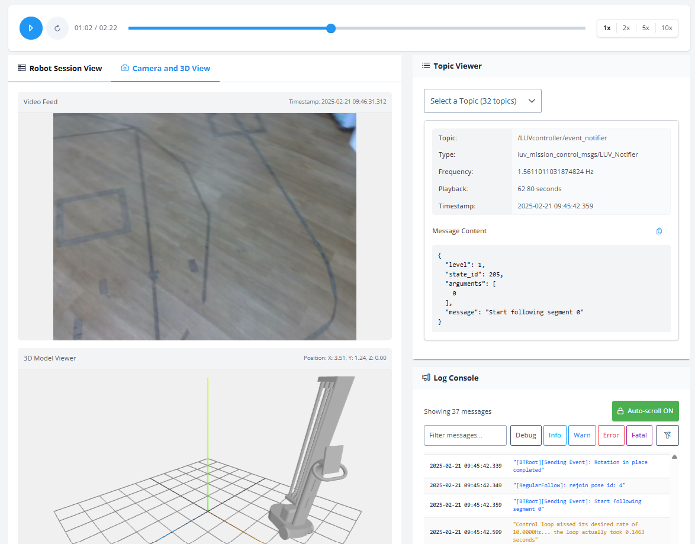

# Ion Reader



## Project Overview

Ion Reader is a web application designed for visualizing and analyzing robot log based on ROS topics. The application provides a comprehensive interface for viewing camera feeds, 3D visualizations, and log data from robotic systems. It's built with Angular and containerized with Docker for easy deployment and scalability.

Key features include:

- Real-time camera feed visualization
- Interactive 3D model view of robot positioning
- Detailed log management and analysis
- Topic viewer for monitoring robot feedback
- Playback controls for reviewing recorded sessions

## Prerequisites

Before setting up Ion Reader, ensure you have the following installed:

- Bash shell environment
- Docker Engine (version 24.0.0 or higher)
- Docker Compose (version 2.17.0 or higher), this should include watch feature
- Git (for cloning the repository)

## Quick Start

### Using Docker Compose (Recommended)

1. Clone the repository:

   ```bash
   git clone https://github.com/huykuka/ion-reader.git
   cd ion-reader
   ```

2. Start the application:

   ```bash
   docker compose up -d
   ```

3. Access the application at [http://localhost:8080](http://localhost:8080)

### Using Docker Run

1. Clone the repository:

   ```bash
   git clone https://github.com/huykuka/ion-reader.git
   cd ion-reader
   ```

2. Pull the Docker image:

   ```bash
   docker pull 010497/ion-reader:latest
   ```

3. Run the container:

   ```bash
   docker run -d -p 8080:80 --name ion-reader 010497/ion-reader:latest
   ```

4. Access the application at [http://localhost:8080](http://localhost:8080)

## Development Setup

### Using Docker Compose for Development

1. Clone the repository:

   ```bash
   git clone https://github.com/huykuka/ion-reader.git
   cd ion-reader
   ```

2. Start the development environment:

   In the root directory of the project, run the following command:

   ```bash
   sh .bin/dev-setup.sh
   ```

3. Access the development server at [http://localhost:4200](http://localhost:4200)

4. The application will automatically reload when you make changes to the source files.

## Building and Deploying

### Building the Docker Image Locally

1. Navigate to the project root:

   ```bash
   cd ion-reader
   ```

2. Run the deployment script:

   In the root directory of the project, run the following command:

   ```bash
   sh .bin/deploy-from-local.prod.sh
   ```

This script will:

- Build the Angular application
- Create a Docker image
- Tag the image with the current version
- Push the image to DockerHub (if confirmed)

## Project Structure

```
ion-reader/
├── .bin/                   # Shell scripts for development and deployment
├── frontend/               # Angular application
│   ├── src/                # Source code
│   ├── docker/             # Docker configurations
│   │   ├── dev/            # Development Docker setup
│   │   └── prod/           # Production Docker setup
│   └── ...
├── docker-compose.yml      # Production Docker Compose configuration
├── docker-compose.dev.yml  # Development Docker Compose configuration
└── ...
```
